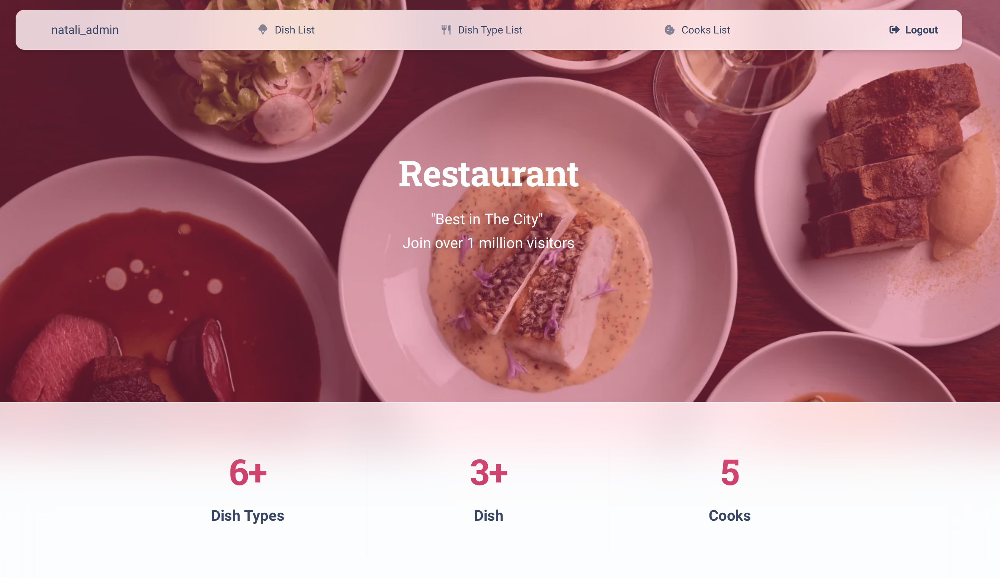

# restaurant_kitchen_service

## Installing / Getting started!

Python3 should be already installed

## Developing

Here's a brief intro about what a developer must do in order to start developing the project further:

git clone https://github.com/restaurant_kitchen_service.git
cd restaurant_kitchen_service/
python3 -m venv venv
source venv/bin/activate
pip install -r requirements.txt
python manage.py runserver #start Django server

## Features

This project is a management system, in which Cooks can create new Dishes & Dishtypes,
and also specify, Cooks which are responsible for every Dishes cooking.
The idea is improving communication between cooks and kitchen

The main functionality include:
-creating, updating and deleting cooks, dishes and dish types
-assign dish to cook

Demo

